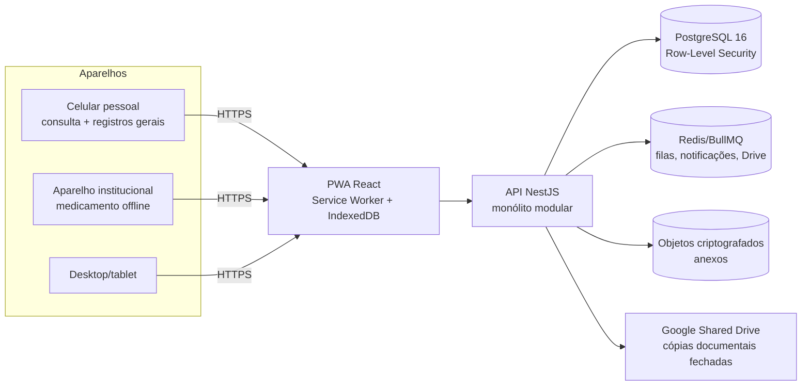

# Arquitetura — Rede Acolher

## Visão de contexto

A Rede Acolher é uma aplicação web responsiva e PWA instalável, usada por educadores,
líderes, equipe técnica, Enfermagem, coordenação e gestão nas 8 unidades de acolhimento
do Pão dos Pobres. Internet oscila; o plantão não pode parar → offline-first.

> **Partições:** a organização em `kernel` + `modules` e as regras de fronteira
> estão em `docs/arquitetura-modular.md`. Resumo: cada módulo tem porta pública,
> manifesto e migrações próprias; um teste falha o build se alguém cruzar.

## Decisões estruturais

1. **Monólito modular** (§4.2): módulos NestJS com fronteiras claras (auth, houses,
   users, audit, …), extraíveis no futuro apenas se escala justificar. Sem microserviços.
2. **Defesa em profundidade no isolamento** (§4.4): a autorização acontece na API
   (guards/serviços) **e** no banco (RLS com `SET LOCAL app.user_id`). Nenhuma consulta
   em nome de usuário roda fora de `DatabaseService.asUser()`. O papel de conexão
   `rede_app` não é superusuário, não tem DELETE e não altera auditoria.
3. **Sessões opacas revogáveis** em vez de JWT (ADR-002): revogação imediata é requisito
   (§4.5); o custo de uma consulta por request é aceitável nesta escala.
4. **Erro 404 uniforme fora de escopo**: objeto de outra casa responde como inexistente,
   sem vazar existência (§23, cenário #1).
5. **Auditoria append-only**: trigger no banco impede UPDATE/DELETE mesmo pelo admin;
   logs guardam metadados, nunca conteúdo sensível (§20, §27).
6. **Transições de estado são comandos de sistema**: admissão, retorno e aceite de
   transferência rodam em funções `SECURITY DEFINER` que verificam a autorização
   internamente. Isso evita afrouxar o RLS para acomodar operações legítimas que
   cruzam fronteiras de casa (§25) — ver `docs/backlog.md`, achados da Fase 2.
7. **Janela T-10/T+10** (§5.12): implementada como configuração
   (`SHIFT_WINDOW_MODE=observe|enforce|off`). No piloto, `observe`: registra violações
   na auditoria sem bloquear — evita impedir fechamento legítimo de plantão.

## Módulos (mapa atual → planejado)

| Módulo (§4.3) | Status | Onde |
|---|---|---|
| identidade/autenticação | ✅ Fase 1 | `backend/src/auth` |
| organizações/unidades | ✅ Fase 1 | `backend/src/houses` |
| funcionários/cargos/escalas | ✅ base (tabelas + vínculos) | `db/migrations/001` |
| auditoria/segurança | ✅ base | `backend/src/audit` |
| acolhidos/episódios/permanências | ✅ Fase 2 | `backend/src/people` |
| documentos/anexos | ✅ Fase 2 (metadados; objetos na Fase 3) | `db/migrations/002` |
| benefícios e dados bancários restritos | ✅ Fase 2 | `backend/src/people/benefits.service.ts` |
| transferências/acervo | ✅ Fase 2 | `backend/src/people/transfers.service.ts` |
| rotina/agenda | ✅ Fase 3 | `backend/src/modules/routine` |
| atividades/execução/substituição | ✅ Fase 3 | `backend/src/modules/activities` |
| chamadas coletivas | ✅ Fase 3 | `backend/src/modules/checks` |
| linha do tempo | ✅ Fase 3 | `backend/src/modules/timeline` |
| notificações/escalonamentos | ✅ Fase 3 | `backend/src/modules/notifications` |
| offline/sincronização | ✅ Fase 3 (servidor) | `backend/src/modules/sync` |
| medicamentos/enfermagem | Fase 4 | — |
| plantões/ATAs/ocorrências | Fase 5 | — |
| relatórios/Drive | Fase 6 | — |
| fila local no aparelho | Fase 4 (IndexedDB no PWA) | `frontend` |

## Ambientes

- **dev**: docker-compose local, seed fictício.
- **homologação** e **produção**: a definir com a instituição (VPS/nuvem gerenciada);
  tudo containerizável. Segredos via variáveis de ambiente; exemplos em `.env.example`.

## Fusos e tempo

Armazenamento em `timestamptz` (UTC); apresentação sempre em `America/Sao_Paulo` (§23).
Offline preserva o horário real do evento e registra o horário de sincronização (§17.3).
