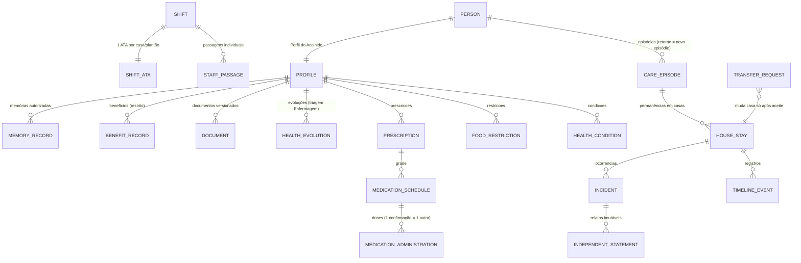
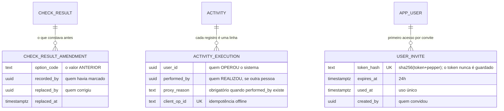
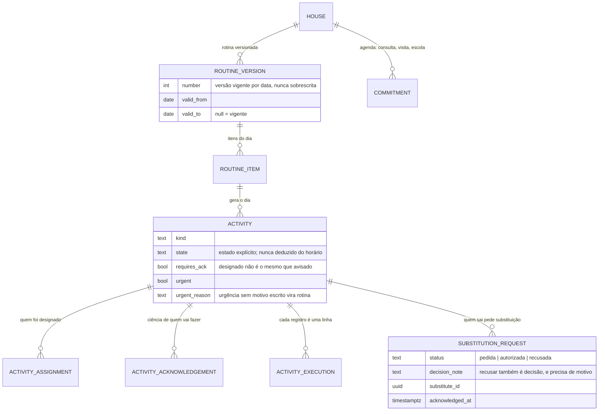
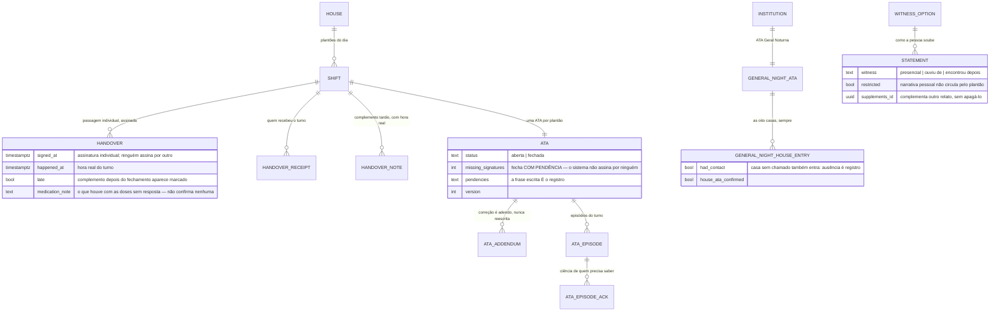
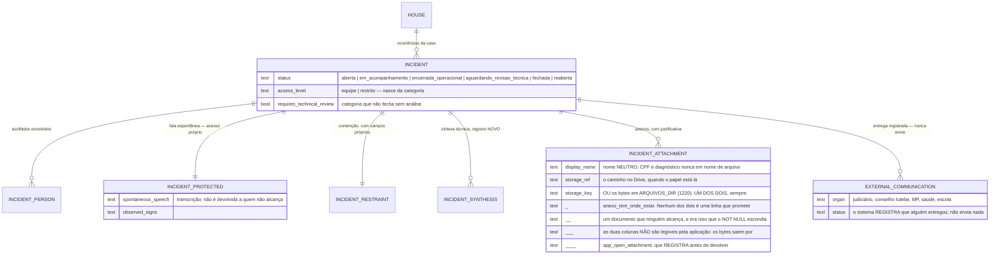
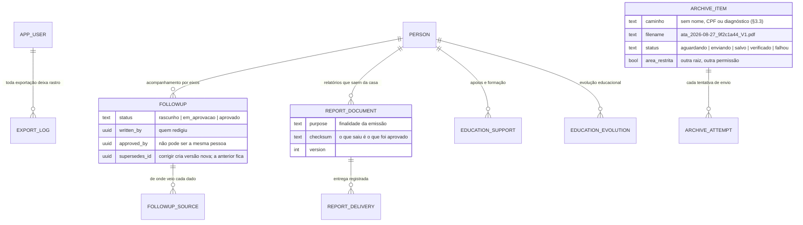

# DER — Modelo de dados

## Fundação (implementado — migração 001)

```mermaid
erDiagram
  INSTITUTION ||--o{ HOUSE : possui
  INSTITUTION ||--o{ APP_USER : emprega
  APP_USER ||--o{ USER_HOUSE_ASSIGNMENT : "vínculo (histórico)"
  HOUSE ||--o{ USER_HOUSE_ASSIGNMENT : recebe
  APP_USER ||--o{ USER_SESSION : "sessões revogáveis"
  APP_USER ||--o{ WORK_SCHEDULE : "escala semanal"
  APP_USER ||--o{ AUDIT_EVENT : "atos auditados"
  HOUSE ||--o{ AUDIT_EVENT : escopo

  APP_USER {
    uuid id PK
    text email UK "e-mail institucional"
    text password_hash "scrypt; nunca em logs"
    role_code role
    bool active "desligado = desativado"
  }
  USER_HOUSE_ASSIGNMENT {
    timestamptz valid_from
    timestamptz valid_to "null = vigente"
  }
  APP_USER_COR {
    text line_color "tom da paleta para a borda das linhas desta pessoa na ATA"
    text _ "NULL = tom automático por hash. Único por casa entre ativos,"
    text __ "conferido em app_definir_cor_da_linha (0990), não por constraint:"
    text ___ "a unicidade é POR CASA e a casa vive em user_house_assignment."
  }
  FAMILY_STAY_MEDICATION {
    uuid family_stay_id UK "uma saída de medicamentos por ida, e não mais"
    jsonb itens "congelado no momento da saída: a prescrição muda depois,"
    text _ "e o papel que foi para a mão da família tem de continuar explicável"
    text __ "o movimento é saida_com_acolhido, nunca consumo: a casa não deu a dose"
  }
  MEDICATION_PURCHASE {
    text items "o que foi comprado, em texto: uma nota traz cinco linhas"
    integer total_cents "o gasto, para a prestação de contas mensal"
    text storage_ref "o caminho no Drive, quando o papel está lá"
    text storage_key "OU os bytes em ARQUIVOS_DIR (1230): a casa escolhe a forma"
    text _ "nenhuma das duas é obrigatória aqui: a compra pode ser lançada antes"
    text __ "de o papel aparecer, e é isso que o resumo conta como pendente"
    text ___ "sem validade: validade é assunto do armário, que já a tem"
  }
  PRESCRIPTION_DOCUMENT {
    text display_name "nome NEUTRO: CPF e diagnóstico nunca em nome de arquivo"
    text storage_ref "o caminho no Drive, quando o papel está lá"
    text storage_key "OU os bytes em ARQUIVOS_DIR (1230). UM DOS DOIS, sempre:"
    text _ "receita_tem_onde_estar. O NOT NULL antigo garantia um texto, e a tela"
    text __ "mandava receita-<timestamp> — uma referência que não apontava a nada"
    text ___ "documento médico: nasce restrito. O educador administra a dose,"
    text ____ "mas a receita traz CID e prescritor, e isso não muda o que ele faz"
  }
  KITCHEN_REQUEST {
    text kind "lanche | cesta_basica"
    uuid person_id FK "NULL = casa toda: a saída do grupo pede para todo mundo"
    text purpose "obrigatório: '1 lanche' sem finalidade obriga a cozinha a adivinhar"
    text status "aberto | cancelado. Cancelar NÃO apaga: a cozinha pode ter comprado"
  }
  OUTING_PERMISSION {
    text status "liberada | acompanhada | suspensa. AUSÊNCIA não é liberação"
    text reason "sempre obrigatório, inclusive para liberar"
    date review_on "obrigatório na suspensa: medida sem prazo vira permanente"
    timestamptz valid_to "decisão nova ENCERRA a anterior; nada se sobrescreve"
  }
  FAMILY_STAY {
    uuid contact_id FK "aponta para person_contact — nunca nome digitado à mão"
    timestamptz expected_return_at "é isto que o aviso lê: 1h antes e depois da hora"
    text return_note "COMO ela chegou, em fato observado — nunca rótulo sobre a criança"
    text brought_back "o que veio com ela: roupa, remédio, documento. Fato do turno seguinte"
    text _ "não há campo houve_alteracao: sim/não gruda, e o detalhe se perde (§8.14)"
    text status "em_andamento | encerrada. Uma aberta por criança"
  }
  USER_SESSION {
    text token_hash UK "sha256(token+pepper)"
    timestamptz expires_at
    timestamptz last_reauth_at "ações sensíveis"
    timestamptz revoked_at
  }
  AUDIT_EVENT {
    text action
    jsonb detail "metadados; sem conteúdo sensível"
    timestamptz at "append-only (trigger)"
  }
```

## Fase 2 — Perfil do Acolhido (implementado — migrações 002–005)

**A permanência ativa é a chave do isolamento.** `app_person_in_scope()` deriva a
visibilidade dela: sem permanência ativa o perfil está no Acervo Histórico, visível
apenas a quem já respondeu por ele. Transferir é encerrar uma permanência e abrir
outra — nada é apagado, e o acesso a benefícios acompanha a casa atual.

## Modelo completo planejado (§23 do Prompt Master)

O ciclo de vida do acolhido separa **pessoa → episódio → permanência → registros**:

Grupos restantes do §23 (notificações/escalonamento, Drive, offline/sync, eliminação
excepcional) entram nas fases 3–6; requisitos transversais de todo agregado:
`institution_id` sempre, `house_id` quando operacional, IDs UUID não previsíveis,
autoria imutável, versão otimista, estados explícitos, classificação de sensibilidade,
CPF único normalizado e protegido, busca sem vazar existência entre casas.

O dicionário de dados completo será gerado por fase, junto de cada migração.

---

## Registros que existem para não perder autoria (fases 8–10)

Três tabelas nasceram de auditoria, não de requisito. Todas seguem a mesma
ideia: quando algo pode ser corrigido, o valor anterior não morre.

**`life_milestone` é O TRABALHO SOCIAL, e não o turno** (migração 0900). O
Gestor Geral responde pelas oito casas e não vai abrir a grade de medicação de
nenhuma; o que ele precisa é do que o acolhimento produziu — passou de ano,
terminou o Médio, entrou no curso, assinou a primeira carteira.

**O risco desta tabela está escrito na migração, antes de ela existir:** contar
conquistas por casa é a distância de um `ORDER BY` de virar ranking de casas,
que é proibido (regra 3). E a proibição não é burocracia — a casa que recebe
adolescentes com medida protetiva recente e a casa-lar com quatro crianças
pequenas não estão na mesma corrida, e o placar faz a primeira parecer pior no
momento em que ela faz o trabalho mais difícil.

Por isso: `app_panorama_das_casas` ordena por `code`, nunca por contagem; não
há média, meta, percentual nem "casa destaque"; e **ausência de marco não é
dado** — a criança sem linha aqui não fracassou.

Três decisões da tabela:

* **o marco é da CRIANÇA**; `house_id` guarda onde ela estava quando aconteceu,
  gravado na hora, porque ela muda de casa e o marco não muda de lugar junto;
* **todo mundo da casa lê**, inclusive o educador. É a parte boa da história, e
  escondê-la de quem acorda a criança todo dia seria transformar em relatório o
  que devia ser motivo de a casa inteira saber. Escrever é da técnica, da
  coordenação e do Gestor Geral;
* **marco não se apaga** — gatilho `app_marco_nao_e_apagado`. Um diploma que
  sumiu do sistema é um diploma que a instituição deixou de reconhecer.

**`hospitalization` é A CRIANÇA NO HOSPITAL, e não fora do acolhimento**
(migração 0890). Pedido da coordenação em 03/09/2026.

O que ela decide:

* **não é saída.** A criança continua da casa, na contagem e na vaga —
  `house_stay` não é tocada. Ela só sai do sistema quando a técnica ou a
  coordenação a removerem, com motivo, e aí é saída, que manda para o acervo;
* **ela sai da linha do dia.** `app_esta_internado(pessoa, dia)` é chamada pela
  chamada e pela grade de medicação. Cobrar da educadora de plantão a
  confirmação do café de uma criança que está no hospital é pedir que ela minta
  ou que ignore o alerta — e o que se ignora todo dia deixa de ser alerta;
* **o dia da alta é dia de casa.** Quem recebe alta às dez da manhã almoça
  aqui. O contrário, no dia da entrada, é assumido: a criança internada às três
  da tarde sai da lista do dia inteiro, e o que já foi registrado de manhã não
  some;
* **a dose que estava prevista não é apagada nem marcada como não
  administrada.** Ela sai da tela e fica no banco, sem juízo: o sistema não
  conclui o que não viu.

`hospitalization_medication` é a medicação dada NO HOSPITAL, em tabela
separada da grade da casa — e a separação é a regra inteira. A grade tem
receita assinada, horário previsto e o nome de quem da casa administrou; dose
de hospital não tem nada disso. Registrá-la lá faria a casa aparecer
administrando o que não administrou. Aqui há `recorded_by` (quem escreveu) e
**não há** `administered_by`, porque não seria verdade.

`hospitalization_companion` é uma LISTA com período, e não um campo na
internação: a criança fica três semanas e quem vai ao hospital muda a cada
plantão. Um campo único guardaria só o último, e "quem estava com ela no dia
12?" ficaria sem resposta.

**`person_contact` são OS TELEFONES DE QUEM APARECE** (migração 0880). Vieram
da lista que a equipe técnica mantinha à mão: por criança, os contatos da
genitora, do padrinho, da tia e do vínculo comunitário, todos na mesma célula
de um documento de texto.

Três coisas que a tabela decide:

* **o vínculo é rótulo, não hierarquia.** Em várias dessas histórias quem
  aparece é a madrinha, e não a genitora;
* **o educador LÊ** (decisão da coordenação, 03/09/2026): quem está com a
  criança precisa saber quem é a pessoa que apareceu no portão. Escrever
  continua sendo da técnica e da coordenação;
* **contato não se apaga, encerra-se com motivo** — gatilho
  `app_contato_nao_e_apagado`. O telefone que deixou de valer é informação:
  alguém tentou por ele e não conseguiu. E há a marca `restricted`, para o
  contato com aproximação suspensa, que exige motivo escrito — quem descobre
  isso às 23h descobre tarde.

**E, desde a migração 1120 (fase 92), quem pode visitar.** A folha da portaria
lê daqui:

* `visit_authorized`, com `visit_authorized_by` e `visit_authorized_at` — a
  marca explícita da técnica ou da coordenação. **Estar na tabela não é estar
  autorizado.** Duas restrições no banco: `contato_restrito_nao_visita` (restrito
  nunca autorizado) e `contato_encerrado_nao_visita`; encerrar um contato
  retira a marca na mesma escrita;
* `cpf`, normalizado em onze dígitos (`contato_cpf_normalizado`). É dado de
  terceiro: inteiro só para quem escreve no cadastro e na folha impressa;
* `photo_key`, `photo_mime`, `photo_at`, `photo_by` — a foto 3×4 do visitante,
  opcional, guardada como a do acolhido, e com saída declarada em
  `arquivo-tem-saida.spec.ts` (`contacts/:contactId/photo`).

**`house_field_permission` é O QUE O PLANTÃO VÊ** (migração 1130, fase 93).
Por casa, quais campos do perfil ficam à vista do educador em plantão —
escola, contatos, equipe de referência, cuidados essenciais.

* **a lista é fechada por CHECK.** Campo novo entra por migração, revisado. É
  ela que impede a coordenação de alcançar motivo judicial, narrativa restrita,
  cofre, benefícios e ocorrência restrita — os cinco que não são negociáveis. A
  mesma lista existe em `campos-do-perfil.ts` e no servidor de mentira, e dois
  testes cobram que as três não divirjam;
* **ausência de linha é LIGADO.** Nada mudou de comportamento quando a migração
  rodou, e nenhuma casa perdeu acesso sem alguém ter decidido;
* **vale só para o educador, e só na casa que decidiu.** A coordenação de uma
  casa não mexe no que a outra enxerga — é o mesmo motivo pelo qual a tela de
  alcance de cargo foi recusada em 27/08;
* **desligado não é invisível:** o perfil continua dizendo que o campo existe,
  quem desligou e por quê. Ausência que mente é pior do que recusa que explica.

**`person_correction` é o HISTÓRICO DA CORREÇÃO DE CADASTRO** (§6.2, migração
0810). Nome escrito errado às 23h, data de nascimento trocada porque a certidão
veio depois: sem uma porta para corrigir, a saída de quem usa é recadastrar — e
aí existem duas crianças e o histórico parte em dois. Corrigir sem histórico
seria pior: um nome que muda em silêncio faz toda passagem assinada e toda ATA
fechada passarem a falar de alguém que, nos papéis de antes, tinha outro nome.
A tabela guarda o que estava, o que passou a estar, quem, quando e por quê, uma
linha por campo, e não aceita UPDATE nem DELETE. Ela é tabela e não
`audit_event` de propósito: a auditoria é área restrita e responde "quem mexeu
no sistema"; esta responde a uma pergunta do CASO — "por que o nome dela mudou
em março?" — e é lida por quem cuida, na tela do perfil.

**`profile_detail_change` é a irmã dela para o que é DESCRIÇÃO** (§6.4, migração
0850): cuidados essenciais, escola, equipe de referência e observações. A rota
que altera esses campos existia desde a fase 2 e nunca teve tela — o perfil
mostrava tudo isso e ninguém conseguia escrever. Ao abrir a porta, o
antes-e-depois veio junto, porque "cuidados essenciais" é o bloco que se lê
antes de dar banho e antes de servir o prato: reescrevê-lo por cima do que a
Enfermagem orientou apagaria uma instrução de proteção sem rastro, já que a
auditoria guarda o NOME do campo e nunca o conteúdo (§20). A diferença para
`person_correction` é o motivo escrito: corrigir o nome exige um, atualizar a
série escolar não — em fevereiro a série muda mesmo, e cobrar justificativa ali
ensina a equipe a escrever "atualização" mil vezes até que ninguém mais leia o
campo. O que se cobra aqui é o rastro.

**`check_bulk` é a CONFERÊNCIA DE MESA** (§10, migração 0780). A regra escrita
é "sem marcação em lote SILENCIOSA", e a do banco é "nada que preencha o que
não foi olhado" — nenhuma proíbe registrar de uma vez o que foi olhado de uma
vez, desde que fique gravado que foi assim. Cada linha de `check_result` que
nasce de uma conferência de mesa aponta para ela por `bulk_id`; corrigir a
linha zera esse vínculo, porque alguém passou a olhar aquela criança. A tabela
não aceita UPDATE nem DELETE: o ato aconteceu. A chamada final do turno não a
aceita — ela existe para alguém contar as crianças uma a uma antes de dormir.

**`check_result_amendment` é preenchida por gatilho, não pelo serviço**
(`tg_check_result_amend`). Qualquer caminho que atualize a marcação da chamada
passa por ele — rota, correção manual, fila offline. Reenvio com o mesmo valor
não gera linha: histórico poluído é histórico que ninguém lê.

**`activity_execution` ganhou autoria dupla.** `user_id` continua significando
quem operou o sistema — não mudou de sentido, e nenhuma consulta antiga passou
a mentir. `performed_by` e `proxy_reason` andam juntos, garantidos por
`CHECK`: nome sem motivo seria assinatura em branco.

**`user_invite` não guarda o token.** Só o hash, como a sessão. Quem tiver o
banco na mão não entra no lugar de ninguém. Índice único parcial garante **um
convite ativo por pessoa**: emitir de novo cancela o anterior, porque dois
convites válidos são duas portas.

### Funções de tempo (fase 8)

`app_hoje()` e `app_fuso()` (migração 0630) são o gêmeo SQL de
`kernel/common/tempo.ts`. **`current_date` está proibido em migração nova:** em
servidor UTC ele vira o dia seguinte a partir das 21h de Porto Alegre, e foi
isso que fez dose de prescrição criada no plantão da noite não ser gerada.

---

# Fases 3 a 7 — o resto do banco (31/08/2026)

> Até aqui o DER cobria a fundação e a fase 2, e as outras 60 tabelas viviam só
> nas migrações. A lacuna não era de forma: quem chega no projeto precisa saber
> **por que** cada tabela existe, e essa resposta estava espalhada.
>
> A lista abaixo é conferida por teste (`documentacao.spec.ts`): toda tabela
> criada por uma migração precisa aparecer neste arquivo. Documentação que a
> máquina não cobra envelhece na primeira pressa.

## Fase 3 — a rotina, o dia e o que se combina

**A rotina é versionada, e a versão é por data.** Mudar o horário do jantar não
reescreve o mês passado: entra uma versão nova, com `valid_from`. Item só entra
em versão vigente da própria casa — foi um dos 12 defeitos.

**A atividade guarda o ESTADO, não o horário.** "Passou das 19h" não é
conclusão; quem conclui é gente. Por isso `state` é explícito e a execução é
uma linha por registro, com `performed_by` e `proxy_reason` quando o líder
registra pelo colega (§10).

## Fase 3 — chamada, linha do tempo, avisos e offline

**`safe_title` existe porque a notificação aparece na tela de bloqueio.** O
aparelho da casa fica em cima da mesa; o nome de uma criança e o motivo não
podem ser lidos por quem passa.

**`client_op_id` é a chave da fila offline.** O aparelho fica sem sinal, a
educadora registra, o registro sobe depois — e subir duas vezes não pode criar
dois. Conflito não se resolve sozinho: vira linha em `sync_conflict`, para
alguém decidir.

## Fase 4 — medicamentos e enfermagem

**A dose não tem estado "não administrada" automático.** Passou da hora e
ninguém confirmou? Continua `aguardando_confirmacao`, e o sistema ESCALONA. A
diferença entre "não temos registro" e "não foi dado" é a diferença entre
apurar e acusar.

**`medication_protocol` existia porque a instituição ainda não tinha decidido**
quem administra em cada período (pendência 33.4.1). Em vez de inventar uma
regra invisível, a decisão virou configuração por casa, com data e autor.

**A pendência foi respondida em 08/09/2026** (migração 0930): a Enfermagem
atende das 9h às 17h, e fora desse horário quem administra é o educador de
plantão, conforme a bula do acolhido. As duas tabelas do protocolo — e a da
autorização nominal — **deixaram de decidir, não de existir**: elas guardam o
que a casa decidiu enquanto ninguém sabia o horário da Enfermagem, e apagá-las
esconderia por que a casa operava daquele jeito (regra 6).

**`prescription_restriction_change` é o que ficou no lugar delas.** A regra
passou a ser aberta por padrão e a EXCEÇÃO é por medicamento — "este aqui só a
Enfermagem dá" —, marcada no próprio esquema (`prescription.nurse_only`), com
motivo obrigatório e o antes-e-depois nesta tabela, que não aceita UPDATE nem
DELETE. A exceção é por medicamento, e não por turno ou por pessoa, porque
injetável continua sendo injetável às 22h — e porque a autorização nominal
fazia a proteção depender de a coordenação lembrar de cadastrar cada educador
novo, com a dose da noite recusada quando ela esquecia.

**`medication_protocol_change` guarda cada decisão dessas** (migração 0860). A
rota que escreve o protocolo também nunca teve tela: a Saúde desenhava a tarja
"Sem definição" em cada período e não havia botão que definisse. Ao abrir a
porta, duas coisas mudaram de peso — a nota deixou de ser opcional, porque uma
decisão da instituição sem a linha que a explica não se revê; e o
`ON CONFLICT DO UPDATE` deixou de sobrescrever em silêncio, porque trocar
"educador autorizado pode dar remédio no turno noturno" de sim para não é a
decisão mais pesada que uma coordenação toma aqui. `NULL` nos campos "antes"
significa que não havia definição e valia o padrão protetivo — diferente de
`false`, que é uma decisão tomada de negar. Lê quem alcança a casa, e não só
quem decide: a educadora que vai (ou não vai) dar o remédio tem o direito de
saber quando isso mudou e sob qual decisão.

## Fase 5 — plantão, passagem, ATA e relatos

**Relatos que se contradizem continuam os dois.** `statement` não tem
atualização: quem quiser corrigir escreve outro, apontando para o primeiro em
`supplements_id`. Num caso de proteção, a versão de cada um é o dado.

**`handover.medication_note` (migração 0940)** é a resposta ao pedido do
Marcelo — "no fim da passagem alguém tem que dizer que deu o remédio" — na
única forma que não fere o §11.2. A passagem LÊ as doses do turno
(`app_doses_do_turno`) e exige a frase quando alguma ficou sem resposta; ela
não confirma dose nenhuma, porque a confirmação é individual, de quem
administrou. A cobrança é de quem assina PRIMEIRO: quatro pessoas no mesmo
turno responderiam quatro vezes sobre as mesmas doses, e a quarta escreveria
qualquer coisa para conseguir ir embora.

**`shift_assignment` é a escala POR DATA** (migração 0950), e nasceu porque a
`work_schedule` — semanal, desde a fundação — não descreve uma 12x36: o ciclo é
de 48 horas e anda pelo calendário, então "toda terça a Joana" é falso na terça
seguinte. As duas convivem: a semanal continua certa para quem tem horário fixo
(a Enfermagem das 9h às 17h), e a 0960 diz a ordem em que `app_missing_handovers`
as consulta — escala do dia, escala semanal, vínculo da casa —, declarando a
fonte na resposta.

Nada se apaga: tirar alguém de um plantão é revogar, com autor e horário, e o
banco recusa DELETE **inclusive do dono** — a pergunta que a tabela existe para
responder é "quem estava na casa naquela noite?". Retirar plantão de data já
passada exige motivo escrito. E não há contagem por pessoa em lugar nenhum:
somar plantões por nome é medição de gente com outro nome (§3.3).

**`ata_note` é a linha da ATA com dono** (migração 0970). O corpo do livro
(`ata.content`) descreve o TURNO e é escrito a várias mãos; a linha descreve um
fato e tem autor, horário e imutabilidade — "a Maria não dormiu bem e fez xixi à
noite" é o exemplo que a Fundação deu ao pedir. Corrigir é escrever outra linha.

`restricted` fecha a linha para a coordenação, a equipe técnica e os líderes —
**no banco**, e não na tela: se ficasse na cor, a primeira tela nova mostraria
tudo (a lição da 0760). Quem não a alcança recebe a CONTAGEM por
`app_ata_restritas`, que é SECURITY DEFINER justamente porque precisa ver o que
a pessoa não vê — sumir por completo criaria a impressão de que não existe
(precedente do §13.7).

`app_ata_anterior` é a porta que faltava para "todos leem a ATA do turno
anterior": o último plantão que COMEÇOU antes deste, e não "ontem" — que erraria
toda manhã, quando o anterior é a noite que acabou de passar.

## Fase 5 — ocorrências e proteção

**Não existe rota de envio, e isso é a garantia.** `external_communication`
guarda que uma pessoa entregou um documento a um órgão — quem entregou, por
qual canal, quando. Procurar por um `POST` que despache é a forma mais rápida
de conferir o §13.6.

**A ordem dos estados é a regra:** a revisão técnica vem DEPOIS do
encerramento operacional, e caso de saúde, medicamento, contenção ou violência
não fecha sem síntese. O banco recusa, não só a tela.

## Fase 6 — acompanhamentos, relatórios e arquivo

**`checksum` responde a uma pergunta de audiência:** o documento que chegou ao
Juízo é o que a coordenação aprovou? Sem ele, "acho que sim".

**O arquivo verifica, não confia.** `salvo` é promessa da rede; `verificado` é
conferência do que chegou. A retentativa é idempotente — mesmo caminho e mesma
versão substituem o mesmo objeto, e um adendo é outra versão, com outro nome.

**`education_support` e `education_evolution` nasceram do relatório de
desenvolvimento** (fase 15): a criança não é só o que deu problema. Sala de
recursos, curso, aprendizagem e a evolução escrita pela equipe entram no
documento que segue para a audiência e para a escola.

### `education_concept`
**O conceito educacional do bimestre** (migração 1430, fase 137), da resposta da
Fundação em 20/09/2026 — *"um conceito geral por período, por bimestre, com
espaço para o porquê"* — e da de 21/09, que disse quem digita: **equipe técnica,
coordenação e Líder Diurno**.

| coluna | o que é |
|---|---|
| `ano`, `bimestre` | o período, **escrito** e não deduzido da data: o conceito do 3º bimestre pode ser digitado em novembro, quando a escola entregou o retorno atrasado |
| `conceito` | três estados — `acompanha`, `acompanha_com_apoio`, `nao_acompanha`. **Não é nota**: é estado do acompanhamento, e só o terceiro pede providência |
| `motivo` | obrigatório, dez caracteres no mínimo. Conceito sem o porquê atravessa meses e vira característica da pessoa — é o argumento que recusou a pontuação de comportamento |
| `substitui_id`, `substituido_em` | corrigir **não altera a linha**: insere outra, apontando para a anterior, que continua legível com o nome de quem a escreveu |

Índice único **parcial** em (`person_id`, `ano`, `bimestre`) onde
`substituido_em IS NULL`: um conceito vigente por criança e período, e as
versões substituídas continuam na tabela — são elas que provam que houve
correção. Lê quem alcança a criança, **o educador de plantão inclusive**: é ele
quem senta ao lado na lição de casa.

### `general_night_house_amendment`
**O que constava ANTES numa linha da ATA Geral** (migração 1440, fase 138), da
decisão da Fundação em 21/09/2026: *"quem corrige a ata é o educador líder,
equipe técnica ou coordenador, tudo ficando registrado para esses 3"*.

É o mesmo desenho da `check_result_amendment` (0670), na linha da casa: o
`INSERT` é de **gatilho**, e `UPDATE`/`DELETE` são revogados do papel da
aplicação — o passado não se edita nem se apaga. Guarda os campos que a folha
mostra (situação, contato, chegada, saída, motivo, pessoas, ação, categoria,
pendências, evento de saúde), mais **quem corrigiu, quando e por quê**.

Duas regras moram no gatilho, e não na aplicação: **enquanto a ATA é rascunho não
há histórico** — é o autor montando a própria folha, e guardar cada tecla encheria
a ATA de *"antes constava"* sobre algo que ninguém leu —, e **reenvio idêntico não
é correção**, para que quem abrir daqui a um ano distinga "corrigido três vezes"
de "alguém clicou três vezes". Depois de assinada, o **motivo é obrigatório**.

### `statement_request`
A cobrança de relato aberta quando uma ocorrência grave nasce. Guarda
entity/entity_id genéricos como o próprio relato — é isso que permite remover
`incidents` sem levar as cobranças junto.

| Coluna | Tipo | Observação |
|---|---|---|
| `user_id` | uuid | de quem se cobra |
| `prompt` | text | a pergunta objetiva que a pessoa lê; **não descreve o fato** |
| `origem` | text | `escala` ou `vinculo` — de onde saiu a lista. Sem escala montada, o sistema DIZ que caiu no vínculo em vez de fingir que sabe |
| `answered_at` / `statement_id` | | atendida por GATILHO no insert do relato, porque o relato entra também pela fila offline |

Índice único por `(entity, entity_id, user_id)`: reabrir a ocorrência não
duplica a cobrança de quem já respondeu.

## Reuniões, combinados e pauta — a partição `alignments`

**`team_meeting` e `team_agreement`** (migração 0840) respondem à pergunta que
alguém faz toda semana: *"o que ficou combinado?"*. O corpo do combinado é
imutável e não se apaga — o que muda é a SITUAÇÃO (vigente, cumprido,
revogado, substituído), com motivo e autor em `agreement_change`. Combinado
reescrito por cima apagaria o que a equipe tinha acertado antes, e é
exatamente isso que alguém vai querer ler seis meses depois.

**`meeting_agenda_item` é A PAUTA QUE QUEM TRABALHA NA CASA PROPÕE** (migração
1140, fase 94, pedido do Marcelo em 09/09). Ela nasce SEM reunião: é para a
próxima, que ainda não existe.

* **recusar e adiar exigem resposta escrita** (`ck_pauta_recusa_responde`), e
  isso está no banco porque é a garantia, não a mensagem. A frase do pedido é
  a razão da tabela existir: *"uma pauta recusada sem resposta é pior do que
  não poder propor"*. Adiar conta como recusar — "fica para a próxima" sem uma
  palavra é recusa com outro nome;
* **decisão sem autor não é decisão** (`ck_pauta_decisao_tem_autor`): é um
  estado que apareceu sozinho;
* **o texto proposto é imutável**, como o do combinado, e não se apaga. Sem
  isso, "mas eu propus outra coisa" volta a ser discussão de memória;
* **propor é de qualquer pessoa da casa**, inclusive o educador e a
  enfermagem; **responder** é da técnica, da liderança de turno e da
  coordenação; **ler é de toda a casa** — resposta que só a coordenação
  enxerga é a mesma coisa que resposta nenhuma;
* **`app_responder_pauta` põe o estado no `UPDATE`** (regra 11): duas pessoas
  respondendo ao mesmo tempo não se sobrescrevem.

**`house_statute` é O ESTATUTO — as regras de convivência** (migração 1150,
fase 95). Permanente, ao contrário do combinado, que é operacional e datado:
"ninguém entra no quarto sem bater" vale para quem chegar depois, e na mesma
lista de "a saída para a fono passa a ser com a educadora da tarde"
envelheceria.

* **dois alcances.** `house_id` nulo é a regra da INSTITUIÇÃO — vale para as
  oito casas e só o Gestor Geral escreve; com casa, é a regra daquela casa, da
  coordenação. Sem isso, ou cada casa reescreve a regra da Fundação com
  palavras diferentes, ou a Fundação decide o horário do silêncio de oito
  casas com rotinas diferentes;
* **`audience`** — todos, equipe, acolhidos. É o que permite afixar na parede
  só o que é das crianças: uma folha com "não se fala do processo judicial na
  frente da criança" pregada no corredor é o oposto do que ela existe para
  fazer;
* **o texto é imutável**, e mudar é escrever outra que substitui
  (`replaces_id`). A anterior fica 'substituida' e legível — quem foi
  advertido em março tem direito a ler a regra de março. Revogar exige motivo
  (`ck_estatuto_revoga_explica`); nada se apaga;
* **`since`**: "a partir de segunda" é como uma casa combina regra nova, e sem
  data a regra valeria desde sempre, inclusive para trás;
* **`app_mudar_estatuto` é `SECURITY DEFINER`, e por isso confere cargo e
  alcance por dentro** — sem esse bloco a coordenação de uma casa revogava
  regra da instituição, passando por cima da policy. Achado pela suíte, na
  fase 95.

**O que a tabela NÃO guarda, e não vai guardar:** quem descumpriu, contagem de
descumprimento, consequência prevista. O sistema já tem onde registrar o que
aconteceu — a ocorrência, com revisão técnica. Um histórico de "quantas vezes a
Alice quebrou a regra 4" é exatamente o documento que ninguém deveria poder
gerar sobre uma criança de 12 anos.

**`birthday_ack` é A CIÊNCIA DO ANIVERSÁRIO** (migração 1160, fase 98). Uma
linha por criança e por ano, quando alguém da casa diz "estamos cientes".

* **é o que faz o aviso PARAR.** Sem ela, ou o sistema repete até o dia — e
  vira ruído, que ensina a ignorar aviso —, ou para sozinho e ninguém sabe se
  alguém viu;
* **a data de nascimento já existia** no perfil desde a 0010. O que faltava era
  a casa saber ANTES: até aqui o aniversário só aparecia DEPOIS, como memória
  no álbum, que é o registro da festa que já houve;
* **`app_aniversarios_proximos` atravessa a virada do ano** — em 28/12, a lista
  de sete dias inclui quem nasceu em 3/1 — e trata 29/02 como 28/02 **só em ano
  comum**; no bissexto, o aniversário é no próprio dia 29;
* **quem dá ciência é a casa, inclusive o educador:** quem prepara aniversário
  na prática é quem está com a criança.

**O que a tabela NÃO guarda:** se a festa aconteceu. O sistema não cobra festa
de ninguém — uma casa com crianças pequenas e uma de adolescentes fazem isso de
formas diferentes, e "fez festa" como campo é o primeiro passo para alguém
cobrar o número depois. O que se registra depois, se a casa quiser, é a memória
no álbum, que é da criança.

## Inventário — 114 tabelas por partição

| Partição | Tabelas |
|---|---|
| identity (13) | institution, house, app_user, user_house_assignment, work_schedule, shift_assignment, user_session, login_attempt, audit_event, institutional_device, staff_role_grant, house_capacity_change, user_invite |
| people (25) | person, care_episode, house_stay, profile_detail, health_condition, food_restriction, document, document_version, benefit_record, memory_record, memory_photo, transfer_request, transfer_message, admission_record, judicial_record, person_credential, person_correction, profile_detail_change, person_contact, family_stay, family_stay_note, outing_permission, kitchen_request, house_field_permission, birthday_ack |
| shifts (12) | shift, handover, handover_receipt, handover_note, ata, ata_note, ata_addendum, ata_episode, ata_episode_ack, general_night_ata, general_night_house_entry, general_night_house_amendment |
| incidents (7) | incident, incident_person, incident_protected, incident_restraint, incident_synthesis, external_communication, incident_attachment |
| medications (12) | prescription, medication_schedule, medication_administration, medication_stock, medication_stock_movement, medication_protocol, medication_authorization, medication_protocol_change, prescription_restriction_change, medication_purchase, prescription_document, family_stay_medication |
| activities (7) | activity, activity_assignment, activity_acknowledgement, activity_execution, substitution_request, commitment, commitment_exception |
| nursing (11) | health_encounter, health_evolution, nursing_triage, health_summary_issue, education_support, education_evolution, education_concept, hospitalization, hospitalization_note, hospitalization_medication, hospitalization_companion |
| reports (6) | followup, followup_source, report_document, report_delivery, export_log, life_milestone |
| checks (4) | collective_check, check_result, check_result_amendment, check_bulk |
| notifications (3) | notification, escalation, escalation_level |
| archive (2) | archive_item, archive_attempt |
| alignments (5) | team_meeting, team_agreement, agreement_change, meeting_agenda_item, house_statute |
| routine (2) | routine_version, routine_item |
| statements (3) | witness_option, statement, statement_request |
| sync (2) | offline_operation, sync_conflict |

Cada partição guarda as próprias migrações. Remover um módulo é remover a
pasta dele — e é por isso que a lista acima é por partição, e não por assunto.

### `commitment_exception`
Uma ocorrência desmarcada de um compromisso que continua valendo. Por DATA, com
motivo e autor. Não apaga nada: a agenda continua mostrando o dia, marcado.

| Coluna | Tipo | Observação |
|---|---|---|
| `id` | uuid | |
| `commitment_id` | uuid | o compromisso que continua vigente |
| `house_id` | uuid | |
| `on_date` | date | o dia desmarcado |
| `reason` | text | mínimo 5 caracteres — quem abrir a agenda depois precisa saber |
| `created_at` / `created_by` | | |
| `undone_at` / `undone_by` | | desfazer não apaga a linha: encerra-a |

Índice único parcial por `(commitment_id, on_date) WHERE undone_at IS NULL`:
uma exceção vigente por data, e o histórico das anteriores fica.

### `family_stay_note`
O relato da convivência familiar. **Uma tabela de linhas, e não de colunas em
`family_stay`** — e a diferença é a decisão inteira da fase 122.

A Fundação corrigiu o desenho antes de ele existir. O pedido de 15/09 era um
acompanhamento que *"fica aberto para ser preenchido por algum educador depois
de uma semana"*, e isso ia virar uma pendência com prazo. Em 16/09 ele voltou:

> *"Acho mais fácil não dar um prazo, mas deixar em aberto para ser registrado
> quando de fato tivermos uma informação. Assim, quando o jovem sair para a
> visita em casa, se abre essa pergunta para ser respondida depois — dessa
> forma não haverá uma pressão para arrancar a informação da criança. Mas isso
> pode ser registrado quantas vezes for necessário, por qualquer educador, tudo
> ficando no perfil do jovem."*

Uma coluna só aceita a última versão, e a última versão apaga a primeira. O que
ela contou na terça não substitui o que se observou no domingo: **soma**.

| Coluna | Tipo | Observação |
|---|---|---|
| `id` | uuid | |
| `family_stay_id` | uuid | a ida a que o relato pertence |
| `house_id` / `person_id` | uuid | copiados da saída, para a RLS desta tabela ser lida sozinha |
| `narrative` | text | mínimo 10 caracteres. Fato observado, nunca rótulo (§8.14) |
| `changed` | boolean | *"se houve alguma alteração, sim, tem que ser notificado"* — o único gatilho de aviso |
| `created_at` / `created_by` | | quem ouviu, e quando |

**O que a tabela NÃO tem, e é o ponto:** `status`, `prazo`, `vence_em`,
`fechado_por`. Não há como fechar um relato. Um campo de prazo viraria cobrança
sobre o educador, e o educador só teria uma forma de baixar uma cobrança dessas
— perguntar de novo para a criança.

**Quem escreve:** qualquer pessoa da equipe da casa, o educador inclusive.
`app_relatar_convivencia` não confere cargo, e isso está escrito lá dentro: a
criança conta para quem ela confia, e quem ela confia quase nunca é quem tem o
cargo mais alto. Exigir a técnica faria o educador contar para a técnica, que
escreveria — e o registro perderia o nome de quem ouviu.

**UPDATE e DELETE revogados.** Escreveu errado, escreve de novo: a linha nova
fica ao lado da antiga, com a hora das duas.

**O aviso sai do SERVIÇO, pelo barramento**, e não de dentro da função. A
partição `people` não pode depender de `notifications`, que é removível — sem o
módulo de avisos, ninguém é avisado, e o registro sobre a criança continua
funcionando.

### `memory_photo`
As fotos de uma vivência — **quantas forem**. Antes, `memory_record` guardava um
`storage_key`, e a educadora que voltava da festa com seis fotos registrava seis
vivências: seis vezes a mesma data, seis vezes a mesma descrição, e o álbum da
criança contando a festa seis vezes.

> *"Eles querem também ter foto das crianças no perfil […] podendo previamente
> visualizar o que está sendo hospedado e confirmar."*

| Coluna | Tipo | Observação |
|---|---|---|
| `id` | uuid | |
| `memory_id` | uuid | a vivência a que a foto pertence |
| `person_id` | uuid | copiado da vivência, para a RLS desta tabela ser resolvida sozinha |
| `storage_key` / `mime` / `sha256` / `file_name` | | o objeto guardado |
| `photo_authorized` | boolean | **por foto**, e não por vivência: a festa pode ter uma foto com uma criança de outra casa, e a autorização dela é outra conversa |
| `position` | int | a ordem em que a educadora escolheu. Sem ela, seis fotos saem embaralhadas a cada consulta, e a primeira — que costuma ser a que ela escolheria para mostrar — deixa de ser a primeira |
| `created_at` / `created_by` | | |

**As fotos que já existiam MUDARAM DE LUGAR.** A migração 1320 move cada
`memory_record` com foto para uma linha desta tabela; as colunas antigas ficam
onde estão, com um `COMMENT` dizendo que são origem histórica e não são mais
lidas. Guardar o mesmo fato em dois lugares é como duas versões da verdade
começam.

**`UPDATE` e `DELETE` revogados.** Foto do álbum de uma criança não se apaga nem
se troca por outra (regra 3).

**Sem contador gravado.** Quantas fotos a vivência tem sai de `app_fotos_da_vivencia`
e de um `count` na leitura: um contador em coluna precisaria de gatilho para
ficar em dia, e um contador errado é pior do que contador nenhum — a tela diria
"3 fotos" e abriria duas.

### `document.mirror_of` e `prescription_document.kind` — o espelho no dossiê
Nenhuma tabela nova: a fase 125 é **uma coluna em cada lado** e uma função.

> *"Se elas quiserem botar alguma bula, alguma receita, alguma coisa ali pela
> enfermagem, que já caia direto no perfil da criança."*

| Coluna | Tipo | Observação |
|---|---|---|
| `document.mirror_of` | text | de onde este documento foi espelhado, no formato `"tabela:id"`. **Nulo na maioria** — quase tudo é anexado direto no dossiê. Índice único parcial: **um espelho por origem** |
| `prescription_document.kind` | text | `receita` ou `bula`. `CHECK` com dois valores |

**`app_espelhar_no_dossie` aponta para o MESMO objeto guardado** — mesmo
`storage_key`, mesmo sha. Não há cópia do arquivo: duas cópias divergem no dia
em que alguém substituir uma delas, e a segunda continuaria parecendo verdadeira.

**A idempotência é `mirror_of`, e não é detalhe.** Sem ela, uma fila offline
reenviada ou um clique duplo no fim de um turno de doze horas criaria um
documento novo, e a pasta da criança encheria de receitas repetidas que ninguém
distingue.

**O espelho chega CONFERIDO.** Quem anexou na tela de origem olhou o arquivo, e
a prescrição já é de uma criança nomeada — o *"é desta criança"* está garantido
pela estrutura. Deixá-lo aguardando faria o contador de "falta conferir" subir
sozinho a cada prescrição, e contador que sobe sozinho é contador que a equipe
aprende a ignorar.

**A função não confere cargo, e está escrito lá dentro:** ela é chamada DEPOIS
de a tela de origem ter conferido quem pode anexar. Repetir a conferência
obrigaria esta função a conhecer as regras das outras telas, e é assim que duas
listas de cargos começam a divergir. O que ela confere é o **alcance da
criança**, que é dela mesma.

**A bula mora na mesma tabela da receita** porque é o mesmo fato: um papel
digitalizado preso a uma prescrição. Uma `prescription_leaflet` idêntica com
outro nome seria a mesma coisa escrita duas vezes, e a segunda esqueceria a
correção que a primeira recebesse. Ela segue a política restrita da receita por
razão prática: **o sigilo não está no papel, está no vínculo** — saber QUE bula
alguém guardou é saber qual remédio a criança toma.

**`medication_purchase` fica de fora.** Ela tem `house_id` e **não tem pessoa**:
a nota fiscal é compra da CASA, e o remédio serve a quem precisar dele.
