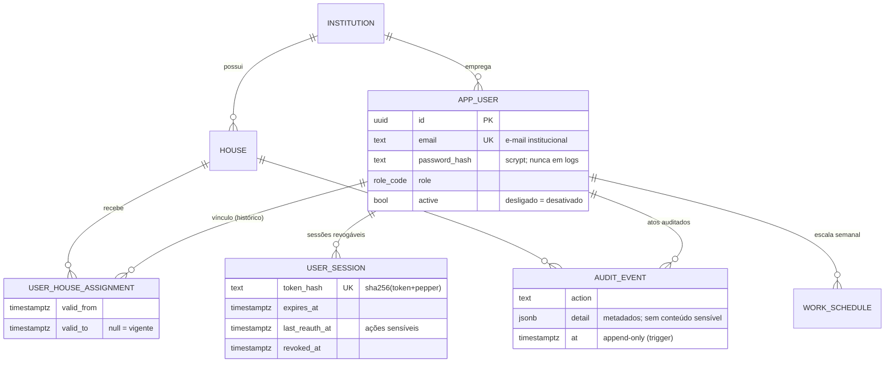
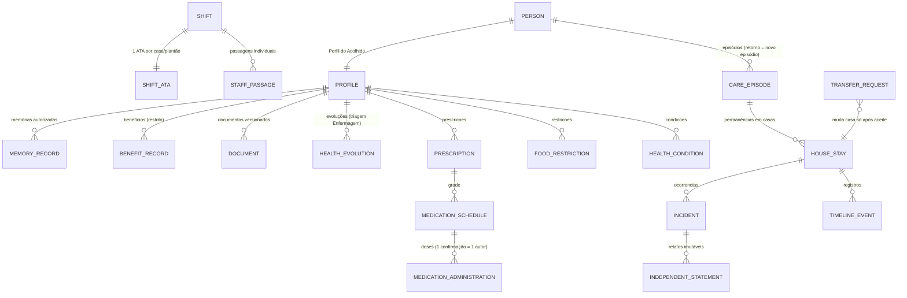
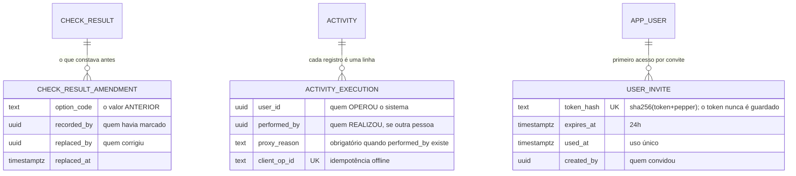

# DER — Modelo de dados

## Fundação (implementado — migração 001)

## Fase 2 — Perfil do Acolhido (implementado — migrações 002–005)

**A permanência ativa é a chave do isolamento.** `app_person_in_scope()` deriva a
visibilidade dela: sem permanência ativa o perfil está no Acervo Histórico, visível
apenas a quem já respondeu por ele. Transferir é encerrar uma permanência e abrir
outra — nada é apagado, e o acesso a benefícios acompanha a casa atual.

## Modelo completo planejado (§23 do Prompt Master)

O ciclo de vida do acolhido separa **pessoa → episódio → permanência → registros**:

Grupos restantes do §23 (notificações/escalonamento, Drive, offline/sync, eliminação
excepcional) entram nas fases 3–6; requisitos transversais de todo agregado:
`institution_id` sempre, `house_id` quando operacional, IDs UUID não previsíveis,
autoria imutável, versão otimista, estados explícitos, classificação de sensibilidade,
CPF único normalizado e protegido, busca sem vazar existência entre casas.

O dicionário de dados completo será gerado por fase, junto de cada migração.

---

## Registros que existem para não perder autoria (fases 8–10)

Três tabelas nasceram de auditoria, não de requisito. Todas seguem a mesma
ideia: quando algo pode ser corrigido, o valor anterior não morre.

**`check_result_amendment` é preenchida por gatilho, não pelo serviço**
(`tg_check_result_amend`). Qualquer caminho que atualize a marcação da chamada
passa por ele — rota, correção manual, fila offline. Reenvio com o mesmo valor
não gera linha: histórico poluído é histórico que ninguém lê.

**`activity_execution` ganhou autoria dupla.** `user_id` continua significando
quem operou o sistema — não mudou de sentido, e nenhuma consulta antiga passou
a mentir. `performed_by` e `proxy_reason` andam juntos, garantidos por
`CHECK`: nome sem motivo seria assinatura em branco.

**`user_invite` não guarda o token.** Só o hash, como a sessão. Quem tiver o
banco na mão não entra no lugar de ninguém. Índice único parcial garante **um
convite ativo por pessoa**: emitir de novo cancela o anterior, porque dois
convites válidos são duas portas.

### Funções de tempo (fase 8)

`app_hoje()` e `app_fuso()` (migração 0630) são o gêmeo SQL de
`kernel/common/tempo.ts`. **`current_date` está proibido em migração nova:** em
servidor UTC ele vira o dia seguinte a partir das 21h de Porto Alegre, e foi
isso que fez dose de prescrição criada no plantão da noite não ser gerada.

> **Nota de cobertura.** Este DER documenta a fundação, a fase 2 e as tabelas
> acima. As fases 3 a 7 (rotina, atividades, chamadas, medicamentos,
> enfermagem, plantão, ocorrências, acompanhamentos, arquivo) estão descritas
> nas migrações de cada módulo, que são a fonte com comentários, mas ainda não
> foram trazidas para cá. É a maior lacuna da documentação hoje.
