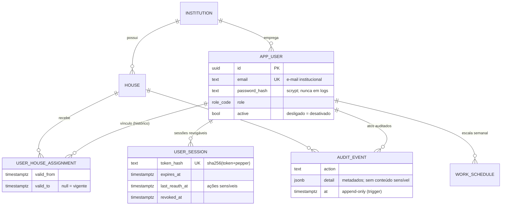
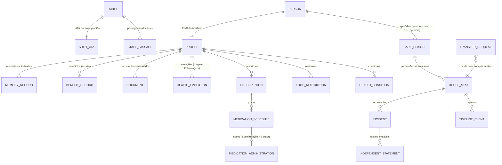

# DER — Modelo de dados

## Fundação (implementado — migração 001)

## Modelo completo planejado (§23 do Prompt Master)

O ciclo de vida do acolhido separa **pessoa → episódio → permanência → registros**:

Grupos restantes do §23 (notificações/escalonamento, Drive, offline/sync, eliminação
excepcional) entram nas fases 3–6; requisitos transversais de todo agregado:
`institution_id` sempre, `house_id` quando operacional, IDs UUID não previsíveis,
autoria imutável, versão otimista, estados explícitos, classificação de sensibilidade,
CPF único normalizado e protegido, busca sem vazar existência entre casas.

O dicionário de dados completo será gerado por fase, junto de cada migração.
