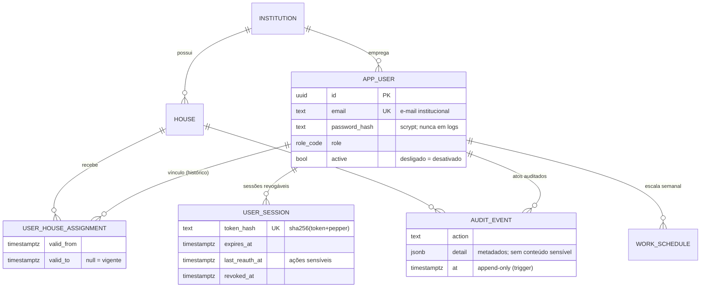
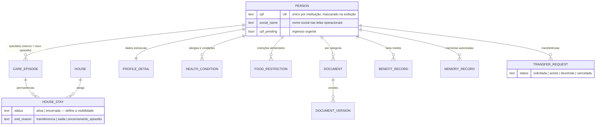
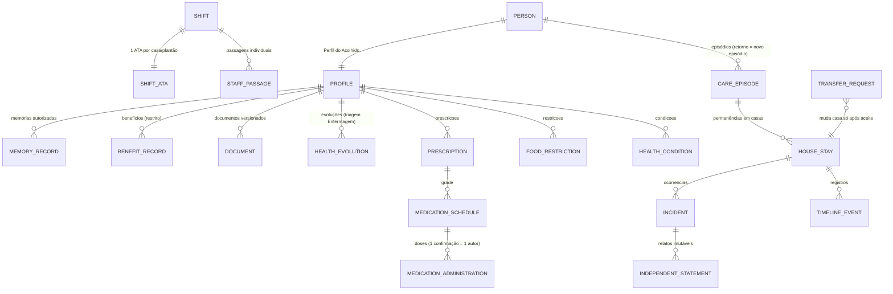
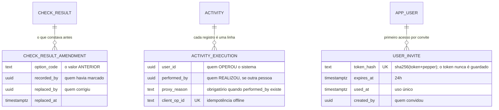
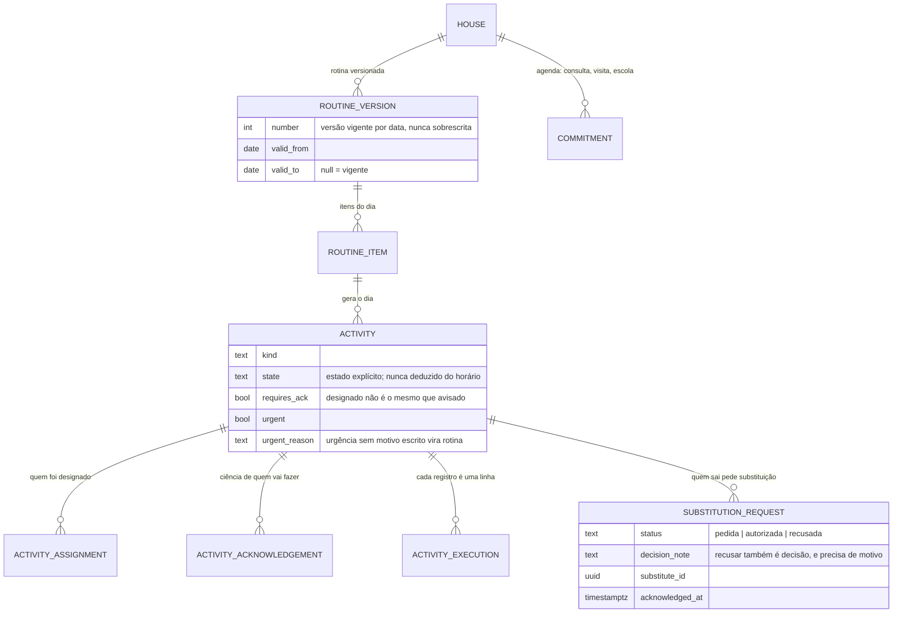
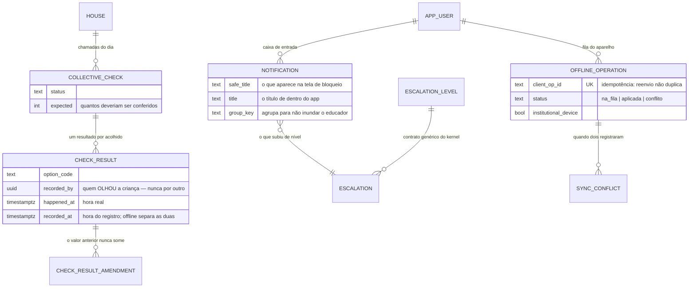
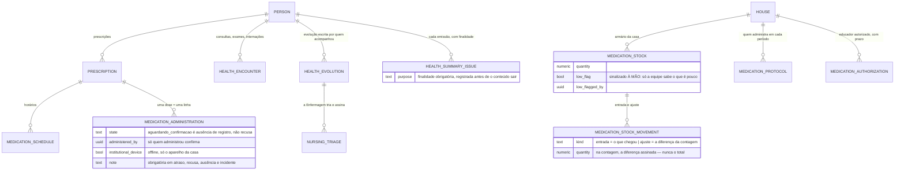
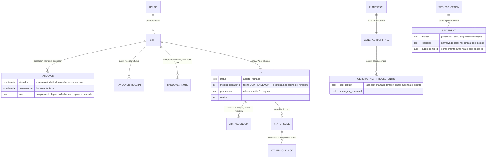
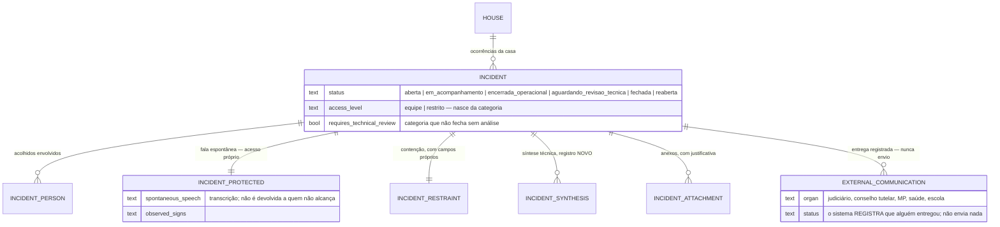

# DER — Modelo de dados

## Fundação (implementado — migração 001)

## Fase 2 — Perfil do Acolhido (implementado — migrações 002–005)

**A permanência ativa é a chave do isolamento.** `app_person_in_scope()` deriva a
visibilidade dela: sem permanência ativa o perfil está no Acervo Histórico, visível
apenas a quem já respondeu por ele. Transferir é encerrar uma permanência e abrir
outra — nada é apagado, e o acesso a benefícios acompanha a casa atual.

## Modelo completo planejado (§23 do Prompt Master)

O ciclo de vida do acolhido separa **pessoa → episódio → permanência → registros**:

Grupos restantes do §23 (notificações/escalonamento, Drive, offline/sync, eliminação
excepcional) entram nas fases 3–6; requisitos transversais de todo agregado:
`institution_id` sempre, `house_id` quando operacional, IDs UUID não previsíveis,
autoria imutável, versão otimista, estados explícitos, classificação de sensibilidade,
CPF único normalizado e protegido, busca sem vazar existência entre casas.

O dicionário de dados completo será gerado por fase, junto de cada migração.

---

## Registros que existem para não perder autoria (fases 8–10)

Três tabelas nasceram de auditoria, não de requisito. Todas seguem a mesma
ideia: quando algo pode ser corrigido, o valor anterior não morre.

**`person_correction` é o HISTÓRICO DA CORREÇÃO DE CADASTRO** (§6.2, migração
0810). Nome escrito errado às 23h, data de nascimento trocada porque a certidão
veio depois: sem uma porta para corrigir, a saída de quem usa é recadastrar — e
aí existem duas crianças e o histórico parte em dois. Corrigir sem histórico
seria pior: um nome que muda em silêncio faz toda passagem assinada e toda ATA
fechada passarem a falar de alguém que, nos papéis de antes, tinha outro nome.
A tabela guarda o que estava, o que passou a estar, quem, quando e por quê, uma
linha por campo, e não aceita UPDATE nem DELETE. Ela é tabela e não
`audit_event` de propósito: a auditoria é área restrita e responde "quem mexeu
no sistema"; esta responde a uma pergunta do CASO — "por que o nome dela mudou
em março?" — e é lida por quem cuida, na tela do perfil.

**`check_bulk` é a CONFERÊNCIA DE MESA** (§10, migração 0780). A regra escrita
é "sem marcação em lote SILENCIOSA", e a do banco é "nada que preencha o que
não foi olhado" — nenhuma proíbe registrar de uma vez o que foi olhado de uma
vez, desde que fique gravado que foi assim. Cada linha de `check_result` que
nasce de uma conferência de mesa aponta para ela por `bulk_id`; corrigir a
linha zera esse vínculo, porque alguém passou a olhar aquela criança. A tabela
não aceita UPDATE nem DELETE: o ato aconteceu. A chamada final do turno não a
aceita — ela existe para alguém contar as crianças uma a uma antes de dormir.

**`check_result_amendment` é preenchida por gatilho, não pelo serviço**
(`tg_check_result_amend`). Qualquer caminho que atualize a marcação da chamada
passa por ele — rota, correção manual, fila offline. Reenvio com o mesmo valor
não gera linha: histórico poluído é histórico que ninguém lê.

**`activity_execution` ganhou autoria dupla.** `user_id` continua significando
quem operou o sistema — não mudou de sentido, e nenhuma consulta antiga passou
a mentir. `performed_by` e `proxy_reason` andam juntos, garantidos por
`CHECK`: nome sem motivo seria assinatura em branco.

**`user_invite` não guarda o token.** Só o hash, como a sessão. Quem tiver o
banco na mão não entra no lugar de ninguém. Índice único parcial garante **um
convite ativo por pessoa**: emitir de novo cancela o anterior, porque dois
convites válidos são duas portas.

### Funções de tempo (fase 8)

`app_hoje()` e `app_fuso()` (migração 0630) são o gêmeo SQL de
`kernel/common/tempo.ts`. **`current_date` está proibido em migração nova:** em
servidor UTC ele vira o dia seguinte a partir das 21h de Porto Alegre, e foi
isso que fez dose de prescrição criada no plantão da noite não ser gerada.

---

# Fases 3 a 7 — o resto do banco (31/08/2026)

> Até aqui o DER cobria a fundação e a fase 2, e as outras 60 tabelas viviam só
> nas migrações. A lacuna não era de forma: quem chega no projeto precisa saber
> **por que** cada tabela existe, e essa resposta estava espalhada.
>
> A lista abaixo é conferida por teste (`documentacao.spec.ts`): toda tabela
> criada por uma migração precisa aparecer neste arquivo. Documentação que a
> máquina não cobra envelhece na primeira pressa.

## Fase 3 — a rotina, o dia e o que se combina

**A rotina é versionada, e a versão é por data.** Mudar o horário do jantar não
reescreve o mês passado: entra uma versão nova, com `valid_from`. Item só entra
em versão vigente da própria casa — foi um dos 12 defeitos.

**A atividade guarda o ESTADO, não o horário.** "Passou das 19h" não é
conclusão; quem conclui é gente. Por isso `state` é explícito e a execução é
uma linha por registro, com `performed_by` e `proxy_reason` quando o líder
registra pelo colega (§10).

## Fase 3 — chamada, linha do tempo, avisos e offline

**`safe_title` existe porque a notificação aparece na tela de bloqueio.** O
aparelho da casa fica em cima da mesa; o nome de uma criança e o motivo não
podem ser lidos por quem passa.

**`client_op_id` é a chave da fila offline.** O aparelho fica sem sinal, a
educadora registra, o registro sobe depois — e subir duas vezes não pode criar
dois. Conflito não se resolve sozinho: vira linha em `sync_conflict`, para
alguém decidir.

## Fase 4 — medicamentos e enfermagem

**A dose não tem estado "não administrada" automático.** Passou da hora e
ninguém confirmou? Continua `aguardando_confirmacao`, e o sistema ESCALONA. A
diferença entre "não temos registro" e "não foi dado" é a diferença entre
apurar e acusar.

**`medication_protocol` existe porque a instituição ainda não decidiu** quem
administra em cada período (pendência 33.4.1). Em vez de inventar uma regra
invisível, a decisão virou configuração por casa, com data e autor.

## Fase 5 — plantão, passagem, ATA e relatos

**Relatos que se contradizem continuam os dois.** `statement` não tem
atualização: quem quiser corrigir escreve outro, apontando para o primeiro em
`supplements_id`. Num caso de proteção, a versão de cada um é o dado.

## Fase 5 — ocorrências e proteção

**Não existe rota de envio, e isso é a garantia.** `external_communication`
guarda que uma pessoa entregou um documento a um órgão — quem entregou, por
qual canal, quando. Procurar por um `POST` que despache é a forma mais rápida
de conferir o §13.6.

**A ordem dos estados é a regra:** a revisão técnica vem DEPOIS do
encerramento operacional, e caso de saúde, medicamento, contenção ou violência
não fecha sem síntese. O banco recusa, não só a tela.

## Fase 6 — acompanhamentos, relatórios e arquivo

**`checksum` responde a uma pergunta de audiência:** o documento que chegou ao
Juízo é o que a coordenação aprovou? Sem ele, "acho que sim".

**O arquivo verifica, não confia.** `salvo` é promessa da rede; `verificado` é
conferência do que chegou. A retentativa é idempotente — mesmo caminho e mesma
versão substituem o mesmo objeto, e um adendo é outra versão, com outro nome.

**`education_support` e `education_evolution` nasceram do relatório de
desenvolvimento** (fase 15): a criança não é só o que deu problema. Sala de
recursos, curso, aprendizagem e a evolução escrita pela equipe entram no
documento que segue para a audiência e para a escola.

## Inventário — 84 tabelas por partição

| Partição | Tabelas |
|---|---|
| identity (12) | institution, house, app_user, user_house_assignment, work_schedule, user_session, login_attempt, audit_event, institutional_device, staff_role_grant, house_capacity_change, user_invite |
| people (16) | person, care_episode, house_stay, profile_detail, health_condition, food_restriction, document, document_version, benefit_record, memory_record, transfer_request, transfer_message, admission_record, judicial_record, person_credential, person_correction |
| shifts (10) | shift, handover, handover_receipt, handover_note, ata, ata_addendum, ata_episode, ata_episode_ack, general_night_ata, general_night_house_entry |
| incidents (7) | incident, incident_person, incident_protected, incident_restraint, incident_synthesis, external_communication, incident_attachment |
| medications (7) | prescription, medication_schedule, medication_administration, medication_stock, medication_stock_movement, medication_protocol, medication_authorization |
| activities (6) | activity, activity_assignment, activity_acknowledgement, activity_execution, substitution_request, commitment |
| nursing (6) | health_encounter, health_evolution, nursing_triage, health_summary_issue, education_support, education_evolution |
| reports (5) | followup, followup_source, report_document, report_delivery, export_log |
| checks (4) | collective_check, check_result, check_result_amendment, check_bulk |
| notifications (3) | notification, escalation, escalation_level |
| archive (2) | archive_item, archive_attempt |
| routine (2) | routine_version, routine_item |
| statements (2) | witness_option, statement |
| sync (2) | offline_operation, sync_conflict |

Cada partição guarda as próprias migrações. Remover um módulo é remover a
pasta dele — e é por isso que a lista acima é por partição, e não por assunto.
